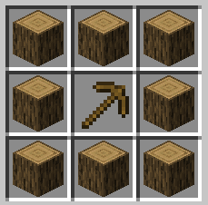
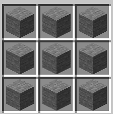

# Hux
마인크래프트 2인전 미사일 전쟁 플러그인

- `Github` : https://github.com/MAKEREKAM/Hux

### 룰
서버에 사람이 4명 있을 때 시작하면 게임이 시작되고, 여러가지 아이템을 사용하여 미사일을 만들어 상대 팀의 코어를 맞추어 코어 HP 200을 없애면 이기는 게임입니다.

### 서버 아이템
게임이 시작되면 2명씩 하늘섬에 스폰됩니다.
각 하늘섬의 스폰 지점에는 5초에 하나씩 참나무 원목이 생성되는 생성기가 존재합니다.

제작대를 **Shift+F**키를 눌러 열 수 있습니다.

아래와 같은 조합법으로 돌 생성기를 만들 수 있습니다.

돌 생성기는 3초에 하나씩 돌이 생성됩니다.

---

아래와 같은 조합법으로 돌 가공기를 만들 수 있습니다.

돌 생성기를 우클릭해 돌을 조약돌로 바꾸는 작업을 할 수 있습니다.

---

아래와 같은 조합법으로 철 생성기를 만들 수 있습니다.

철 생성기는 3초에 하나씩 철 광석이 생성됩니다.

---

아래와 같은 조합법으로 제련기를 만들 수 있습니다.

제련기를 우클릭해서 열린 창은 좌클릭해 철 광석을 철 주괴로, 우클릭해 금 광석을 금 주괴로 바꾸는 작업을 할 수 있습니다.

---

아래와 같은 조합법으로 금 생성기를 만들 수 있습니다.

금 생성기는 6초에 하나씩 금 광석이 생성됩니다.

---

아래와 같은 조합법으로 미사일을 만들 수 있습니다.

미사일을 우클릭해 날릴 수 있고, 코어에 닿을 시 4의 피해를 줍니다.

---

아래와 같은 조합법으로 강력한 미사일을 만들 수 있습니다.

미사일을 우클릭해 날릴 수 있고, 코어에 닿을 시 12의 피해를 줍니다.
가운데 크리퍼 머리는 일반 미사일입니다.

---

미사일을 제외한 모든 블럭 아이템은 F 키를 눌러 자신이 있는 위치에 설치할 수 있습니다.